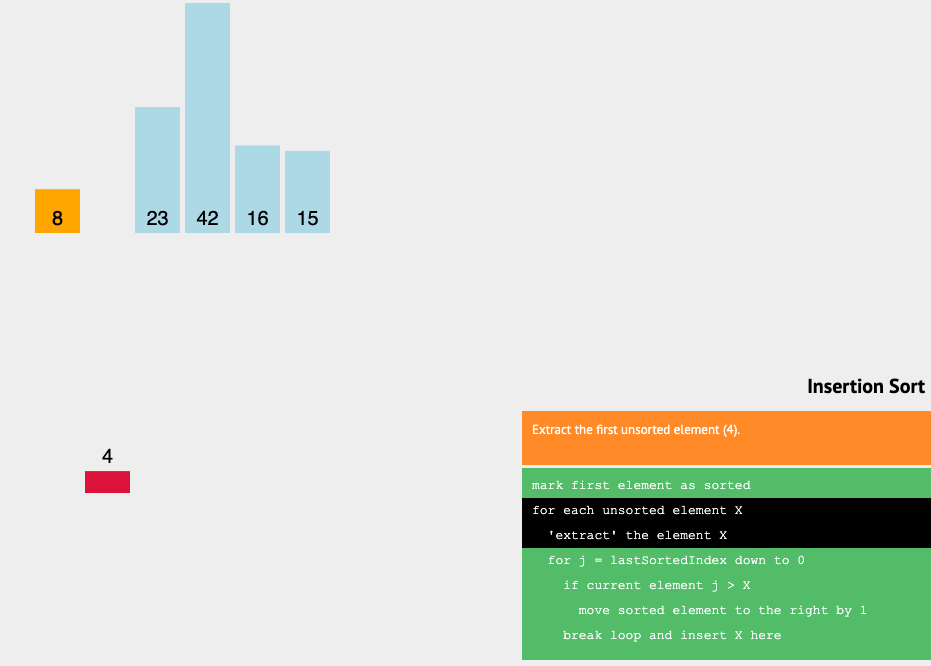
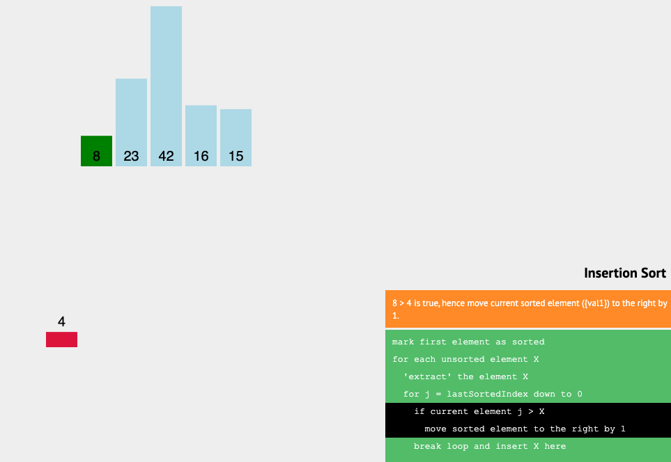
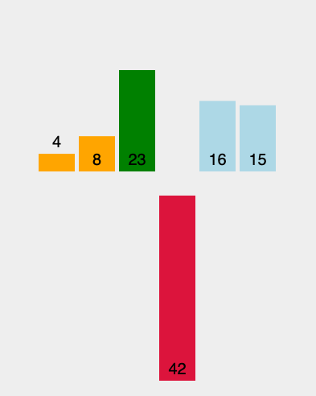
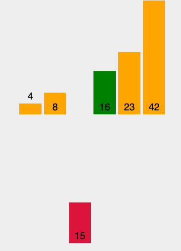

# Code Challenge Class 26 - Insertion Sort Blog Post

### [PR in Github](https://github.com/nickibaldwin/data-structures-and-algorithms/pull/33)

### Insertion Sort:

Insertion sort builds up the sort by gradually creating a larger left half which is always sorted, but iterating over the array and sorting the values into order.

### Pseudocode:

    InsertionSort(int[] arr)
    
      FOR i = 1 to arr.length
      
        int j <-- i - 1
        int temp <-- arr[i]
        
        WHILE j >= 0 AND temp < arr[j]
          arr[j + 1] <-- arr[j]
          j <-- j - 1
          
        arr[j + 1] <-- temp

### How To:

1. First start by picking the second element in the array, since we're comparing it to the first element (to its left) in the array.

2.  Next, compare the second element with the one before it, and swap if the left is lower than the current element.



  Because i = 4 which is less than 8, the 4 is moved to the left.



3. Continue to the next element (moving to the right) and if it's larger than that of its left, then swap. Continue left until the current element has found it's correct spot, meaning is in numerical order compared to the element to its left.

42 is larger than 23, so it will remain in that position.



4. Repeat until the entire array is sorted, and return that array.



### Code: 

```javascript
function insertionSort(arr){
    for(var i = 1; i < arr.length; i++){
        let currentValue = arr[i];
        for(var j = i - 1; j >= 0 && arr[j] > currentValue; j--){
            arr[j+1] = arr[j]
        }
        arr[j+1] = currentValue;
        console.log(arr);
    }
    return arr;
}

insertionSort([8, 4, 23, 42, 16, 15])
```

### Efficency:

- Time: O(n^2)

- Space: O(1)

### Resources:

- [Udemy Master Class - Javascript Algorithms and Data Structures](https://www.udemy.com/course/js-algorithms-and-data-structures-masterclass/learn/lecture/8344200#overview)

- [VisuAlgo](https://visualgo.net/en/sorting)
