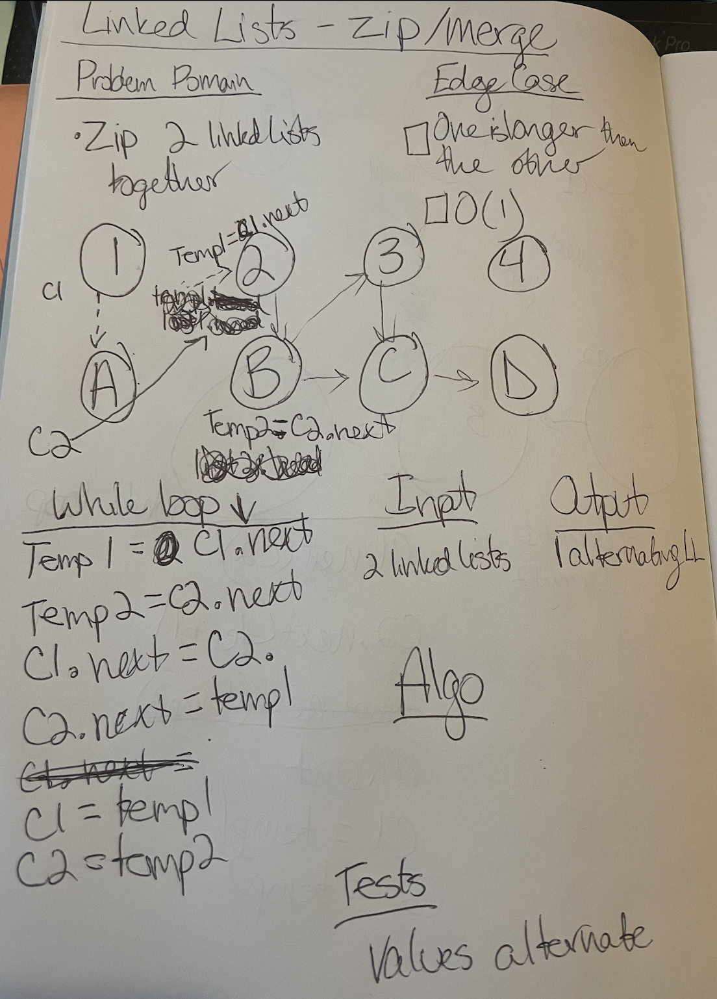

# Code Challenge Class 06 - Append Linked List

### [Solution Code](challenges401/llZip/ll-zip.js)

### [Test Code](challenges401/llZip/__test__/llZip.test.js)

### [PR in Github](https://github.com/nickibaldwin/data-structures-and-algorithms/pull/22)

### [Github Actions](https://github.com/nickibaldwin/data-structures-and-algorithms/actions)

## Setup 

Install proper dependencies:

  `npm i jest`

Test Application:

  `npm run test llZip.tests.js`

<!-- TODO:  -->
## Challenge Summary

Zip two linked lists.

## Challenge Description

Write a function called **zipLists** which takes two linked lists as arguments. Zip the two linked lists together into one so that the nodes alternate between the two lists and return a reference to the head of the zipped list. 
  
## Approach & Efficiency

### References:

- [Udemy Master Class - Javascript Algorithms and Data Structures: Singly Likned List](https://www.udemy.com/course/js-algorithms-and-data-structures-masterclass/learn/lecture/8344200#overview)
