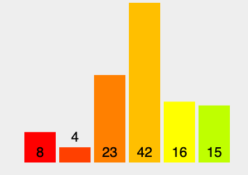
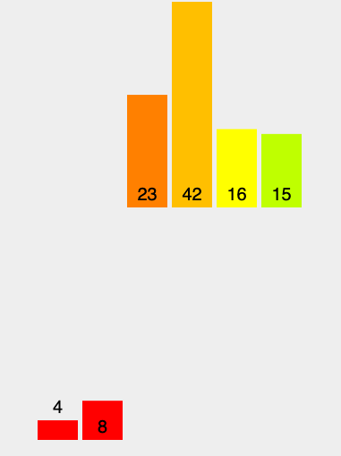
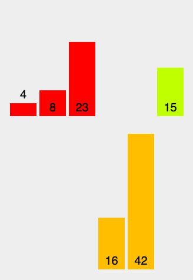
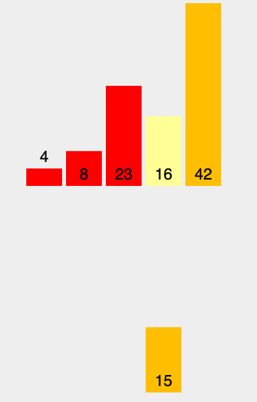
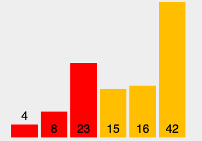

# Code Challenge Class 27 - Merge Sort Blog Post

### [PR in Github](https://github.com/nickibaldwin/data-structures-and-algorithms/pull/34)

### Merge Sort:

Divide and Conquer Algo. It divides input array in two halves, calls itself for the two halves and then merges the two sorted halves.

Merge sort is good for sorting linked lists, but slower compared to other sorting algorithms for smaller tasks. Better for large data sets than insertion sort.

Two functions are required for this algorithm - `.merge()` - used for merging two halves. And, `.MergeSort()` - which recursively calls itself to divide the array until size becomes one.

### Pseudocode:

    ALGORITHM Mergesort(arr)
        DECLARE n <-- arr.length
              
        if n > 1
          DECLARE mid <-- n/2
          DECLARE left <-- arr[0...mid]
          DECLARE right <-- arr[mid...n]
          // sort the left side
          Mergesort(left)
          // sort the right side
          Mergesort(right)
          // merge the sorted left and right sides together
          Merge(left, right, arr)

    ALGORITHM Merge(left, right, arr)
        DECLARE i <-- 0
        DECLARE j <-- 0
        DECLARE k <-- 0

        while i < left.length && j < right.length
            if left[i] <= right[j]
                arr[k] <-- left[i]
                i <-- i + 1
            else
                arr[k] <-- right[j]
                j <-- j + 1
                
            k <-- k + 1

        if i = left.length
          set remaining entries in arr to remaining values in right
        else
          set remaining entries in arr to remaining values in left

### How To:

1. First start by splitting the array into partitions of one.



2. Next recursively merge adjacent partitions

        for i = leftPartIdx to rightPartIdx

          if leftPartHeadValue <= rightPartHeadValue

            copy leftPartHeadValue

          else: copy rightPartHeadValue


3. Repeat until the entire array is sorted, and return elements to the original array.



Below 16 and 42 switched in the temp array, and then will be copied back into the original array.



Below [16, 42] will be merged with [15]. Since 16 (left partition) > 15 (right partition), then 15 will be copied into the temp array.



Finally - sorted



### Code: 

```javascript
//Split array
function merge(arr1, arr2){
    let results = [];
    let i = 0;
    let j = 0;
    while(i < arr1.length && j < arr2.length){
        if(arr2[j] > arr1[i]){
            results.push(arr1[i]);
            i++;
        } else {
            results.push(arr2[j])
            j++;
        }
    }
    while(i < arr1.length) {
        results.push(arr1[i])
        i++;
    }
    while(j < arr2.length) {
        results.push(arr2[j])
        j++;
    }
    return results;
}

// Recrusive Merge Sort
function mergeSort(arr){
    if(arr.length <= 1) return arr;
    let mid = Math.floor(arr.length/2);
    let left = mergeSort(arr.slice(0,mid));
    let right = mergeSort(arr.slice(mid));
    return merge(left, right);
}

mergeSort([8, 4, 23, 42, 16, 15]);
```

### Efficency:

- Space: O(n log(n))

- Time: O(n log(n))

### Resources:

- [Udemy Master Class - Javascript Algorithms and Data Structures](https://www.udemy.com/course/js-algorithms-and-data-structures-masterclass/learn/lecture/8344200#overview)

- [VisuAlgo](https://visualgo.net/en/sorting)

- [Geeks for Geeks](https://www.geeksforgeeks.org/merge-sort/)