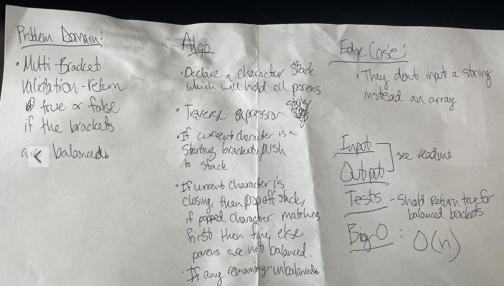

# Code Challenge Class 13 - Multi Bracket Validation

### [Solution Code](challenges401/multiBracketValidation/multi-bracket-validation.js)

### [Test Code](challenges401/queueWithStacks/__test__/multi-bracket-validation.test.js)

### [PR in Github](https://github.com/nickibaldwin/data-structures-and-algorithms/pull/28)

## Setup

Install proper dependencies:

  `npm i jest`

Test Application:

  `npm run test multi-bracket-validation.test.js`

## Challenge Summary

Multi-bracket Validation

## Challenge Description

Create a function called `multiBracketValidation(input)`

Your function should take a string as its only argument, and should return a boolean representing whether or not the brackets in the string are balanced. There are 3 types of brackets:

- Round Brackets : `()`
- Square Brackets : `[]`
- Curly Brackets : `{}`

## Input/Output

INPUT | OUTPUT
-----|-------
`{} `| `TRUE`
`{}(){}`|  TRUE
`()[[Extra Characters]] `| TRUE
`(){}[[]]`| TRUE
`{}{Code}[Fellows](()) `|TRUE
`[({}] `|FALSE
`(]( `|FALSE
`{(}) `|FALSE

Edge Case:

INPUT | OUTPUT | WHY
-----|-------|-----------
`{ `| FALSE |error unmatched opening { remaining.
`) `|FALSE |error closing ) arrived without corresponding opening.
`[}`| FALSE |error closing }. Doesn’t match opening (
  
## Approach & Efficiency

### References:

- [Udemy Master Class - Javascript Algorithms and Data Structures](https://www.udemy.com/course/js-algorithms-and-data-structures-masterclass/learn/lecture/8344200#overview)

- [Medium -Parenthesis Matching Problem](https://paulrohan.medium.com/parenthesis-matching-problem-in-javascript-the-hacking-school-hyd-7d7708278911)
