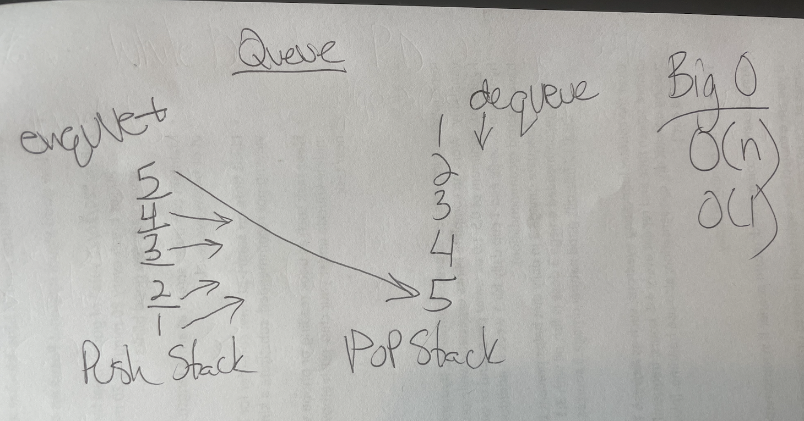

# Code Challenge Class 11 - Queue with Stacks

### [Solution Code](challenges401/queueWithStacks/queue-with-stacks.js)

### [Test Code](challenges401/queueWithStacks/__test__/queue-with-stacks.test.js)

### [PR in Github](https://github.com/nickibaldwin/data-structures-and-algorithms/pull/26)

## Setup

Install proper dependencies:

  `npm i jest`

Test Application:

  `npm run test queue-with-stacks.test.js`

## Challenge Summary

Create a stack and a queue.

## Challenge Description

Create a brand new `PseudoQueue` class. Do not use an existing Queue. Instead, this PseudoQueue class will implement our standard queue interface (the two methods listed below), but will internally only utilize 2 `Stack` objects. Ensure that you create your class with the following methods:

- `enqueue(value`) which inserts value into the PseudoQueue, using a first-in, first-out approach.

- `dequeue()` which extracts a value from the PseudoQueue, using a first-in, first-out approach.

The `Stack` instances have only `push`, `pop`, and `peek` methods. You should use your own Stack implementation. Instantiate these Stack objects in your PseudoQueue constructor.

## Example

`enqueue(value)`

INPUT | ARGS | OUTPUT
-----|-----|-------
[10]->[15]->[20] | 5 | [5]->[10]->[15]->[20]
(EMPTY) | 5 | [5]

`dequeue()`
INPUT | ARGS | OUTPUT
-----|-----|-------
[5]->[10]->[15]->[20] | 20 | [5]->[10]->[15])
[5]->[10]->[15] | 15 | 	[5]->[10]

## Test

### `npm run test queue-with-stacks.test.js`
  
## Approach & Efficiency

### References:

- [Implementing Queue using Stavks in Javascript](http://progressivecoder.com/implementing-queue-using-stacks-in-javascript/)

- [Udemy Master Class - Javascript Algorithms and Data Structures](https://www.udemy.com/course/js-algorithms-and-data-structures-masterclass/learn/lecture/8344200#overview)

- Thanks to Lydia for sharing structuring/workflow and the above links!