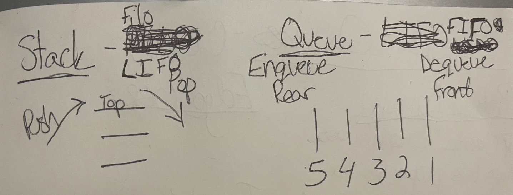

# Code Challenge Class 10 - Stack and Queue Implementation

### [Solution Code - Stacks](challenges401/stacksAndQueues/stacks.js)

### [Solution Code - Queues](challenges401/stacksAndQueues/queues.js)

### [Test Code - Stacks](challenges401/stacksAndQueues/__tests__/stacks.test.js)

### [Test Code - Queues](challenges401/stacksAndQueues/__tests__/queues.tests.js)

### [PR in Github](https://github.com/nickibaldwin/data-structures-and-algorithms/pull/24)

## Setup

Install proper dependencies:

  `npm i jest`

Test Application:

  `npm run test stacks-and-queues.test.js`

## Challenge Summary

Create a stack and a queue.

## Challenge Description

Create a **Stack** class that has a top property. Define methods of **push, pop, and peek** to maniuplate the data accordingly. Also, check to make sure the stack is empty at the end.

Create a **Queue** class that has a top property. Define methods of **push, pop, and peek** to maniuplate the data accordingly. Also, check to make sure the queue is empty at the end.
  
## Approach & Efficiency

### References:

- [Udemy Master Class - Javascript Algorithms and Data Structures: Singly Likned List](https://www.udemy.com/course/js-algorithms-and-data-structures-masterclass/learn/lecture/8344200#overview)
