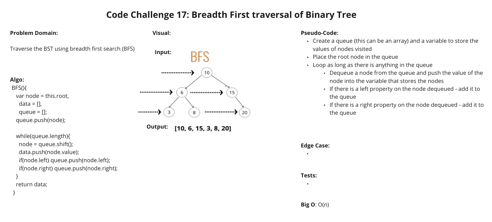

# Code Challenge Class 17 - Breadth First

### [Solution Code](challenges401/tree/binary-tree.js)

### [Test Code](challenges401/tree/__test__/tree.test.js)

### [PR in Github](https://github.com/nickibaldwin/data-structures-and-algorithms/pull/31)

## Setup

Install proper dependencies:

  `npm i jest`

Test Application:

  `npm run test tree.test.js`

## Challenge Summary

Write a breadth first traversal method. Return the values in the order in which we were encountered.

## Challenge Description

- Write a breadth first traversal method which takes a Binary Tree as its unique input. Without utilizing any of the built-in methods available to your language, traverse the input tree using a Breadth-first approach, and return a list of the values in the tree in the order they were encountered.

## Approach & Efficiency

## API

`preOrder`, `inOrder`, and `postOrder`: returns an array of the values, ordered appropriately.

`add()`: accepts a value, and adds a new node with that value in the correct location in the binary search tree.

`contains()`: accepts a value, and returns a boolean indicating whether or not the value is in the tree at least once.

`findMaximumValue()`: find the maximun value in a binary tree.

`BFS()`: breadth first traversal

### References:

- [Udemy Master Class - Javascript Algorithms and Data Structures](https://www.udemy.com/course/js-algorithms-and-data-structures-masterclass/learn/lecture/8344200#overview)
