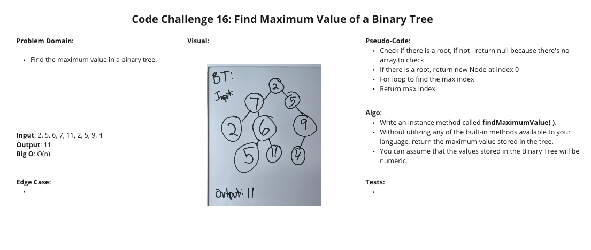

# Code Challenge Class 16 - Maximum Value in a Binary Tree

### [Solution Code](challenges401/tree/binary-tree.js)

### [Test Code](challenges401/tree/__test__/binary-tree.test.js)

### [PR in Github](https://github.com/nickibaldwin/data-structures-and-algorithms/pull/30)

## Setup

Install proper dependencies:

  `npm i jest`

Test Application:

  `npm run test binary-tree.test.js`

## Challenge Summary

Find the Maximum Value in a Binary Tree

## Challenge Description

- Write an instance method called `findMaximumValue()`. Without utilizing any of the built-in methods available to your language, return the maximum value stored in the tree. You can assume that the values stored in the Binary Tree will be numeric.

## Approach & Efficiency

## API

`preOrder`, `inOrder`, and `postOrder`: returns an array of the values, ordered appropriately.

`add()`: accepts a value, and adds a new node with that value in the correct location in the binary search tree.

`contains()`: accepts a value, and returns a boolean indicating whether or not the value is in the tree at least once.

`findMaximumValue()`: find the maximun value in a binary tree.

### References:

- [Udemy Master Class - Javascript Algorithms and Data Structures](https://www.udemy.com/course/js-algorithms-and-data-structures-masterclass/learn/lecture/8344200#overview)

- [Medium](https://medium.com/@eric_lum/maximum-binary-tree-in-javascript-955d1207f385)