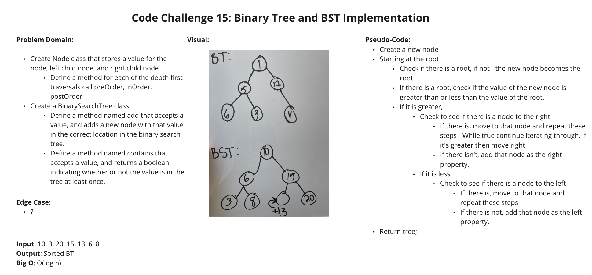

# Code Challenge Class 15 - Multi Bracket Validation

### [Solution Code](challenges401/tree/binary-tree.js)

### [Test Code](challenges401/tree/__test__/binary-tree.test.js)

### [PR in Github](https://github.com/nickibaldwin/data-structures-and-algorithms/pull/29)

## Setup

Install proper dependencies:

  `npm i jest`

Test Application:

  `npm run test binary-tree.test.js`

## Challenge Summary

Implementation: Trees

## Challenge Description

- Create a Node class that has properties for the value stored in the node, the left child node, and the right child node.

- Create a BinaryTree class

  - Define a method for each of the depth first traversals called `preOrder`, `inOrder`, and `postOrder` which returns an array of the values, ordered appropriately.

- Any exceptions or errors that come from your code should be semantic, capturable errors. For example, rather than a default error thrown by your language, your code should raise/throw a custom, semantic error that describes what went wrong in calling the methods you wrote for this lab.

- Create a BinarySearchTree class
  
  - Define a method named `add` that accepts a value, and adds a new node with that value in the correct location in the binary search tree.

  - Define a method named `contains` that accepts a value, and returns a boolean indicating whether or not the value is in the tree at least once.

## Approach & Efficiency

## API

`preOrder`, `inOrder`, and `postOrder`: returns an array of the values, ordered appropriately.

`add()`: accepts a value, and adds a new node with that value in the correct location in the binary search tree.

`contains()`: accepts a value, and returns a boolean indicating whether or not the value is in the tree at least once.

### References:

- [Udemy Master Class - Javascript Algorithms and Data Structures](https://www.udemy.com/course/js-algorithms-and-data-structures-masterclass/learn/lecture/8344200#overview)
